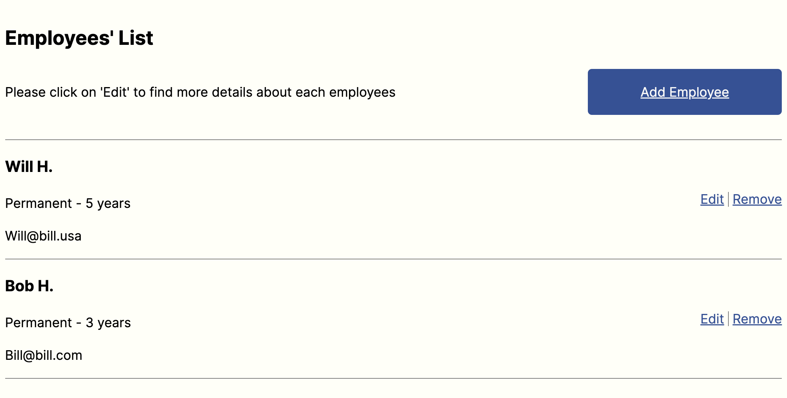
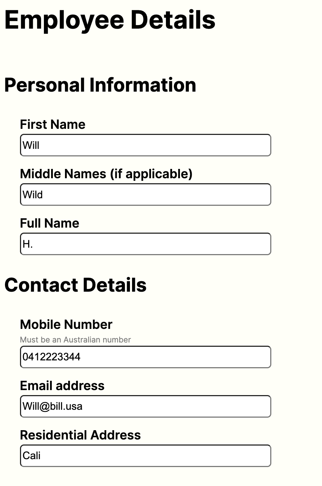
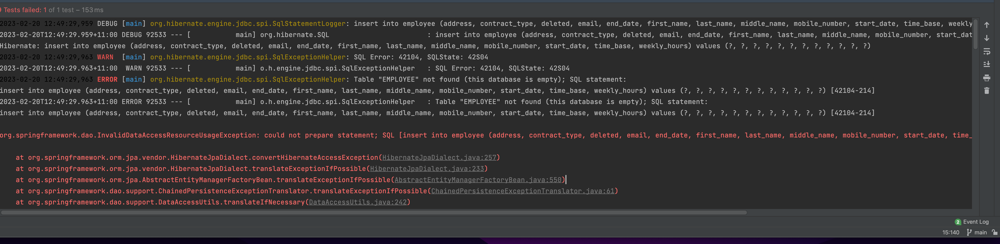

# Employee Creator API

---

## Requirements / Purpose

We need a web application to create, list, modify and delete employees.
The application should consist of a Spring RESTful API and a React Typescript frontend.
The schema for the employee is left to the criteria of the candidate.

## Stacks

## Frontend

-   React-TypeScript (initialized with Vite)
    -   SASS
    -   React Form Hook / Yup
    -   Axios
    -   React Router DOM
    -   Vitest / React Testing Library

## Backend

-   Java / SpringBoot

    -   Spring Web,
    -   Validation I/O
    -   Spring Testing
    -   Spring Data JPA
    -   MySQL Driver
    -   Spring DevTools
    -   Junit5 / JAssert

---

## Build Steps

### Requirements

This project will require you to have a few things already installed on your machine in order to run it. If you do not have that on your machine, check out the links attached.

&rarr; [Node.js](https://nodejs.org/en/) \
&rarr; [mySQL](https://www.mysql.com/downloads/) as well as your favorite SQL Database Management System (DBMS), I use [MySQLWorkbench](https://dev.mysql.com/downloads/workbench/) \
&rarr; Your favorite IDE - I used [VSCode](https://code.visualstudio.com/download) to develop the Frontend and [IntelliJ](https://www.jetbrains.com/idea/download/?source=google&medium=cpc&campaign=9736964866&term=intellij%20idea&content=602143185778&gclid=CjwKCAiA0cyfBhBREiwAAtStHF6mDZ1o8uw-jfQWGpBZnWlxOJ6WkJtDmO0UTXBgP4dykGuq-Y3hDxoCfWUQAvD_BwE#section=mac) for the backend \
&rarr; Your favorite Web Browser

### Frontend

For non hosted version:

> Once the repository cloned to your local machine, run the below commands in your terminal / GitBash from the project directory\
> `cd frontend`\
> `npm run dev`

Vite will display which port to access on your localhost (e.g. http://localhost:5173/)

### Backend

-   SprinBoot Server

    > Once you have cloned the project's repository to your local machine you will want to import that project into your IDE as a Maven project\
    > Configure the application main class to run App.java using JDK v.17\
    > Run the application\
    > This will launch an instance of the SpringBoot server on your machine's port 8080 (http://localhost:8080)

-   SQL Database

    > If the project is run locally, you will also need an database instance to connect to your server.\
    > Create a new mySQL DB in your DBMS\
    > Update the application.properties file in your /backend/src/main/resources\
    > `spring.datasource.url = <YOUR_DB_URL>`\
    > `spring.datasource.username = <YOUR_USERNAME>`\
    > `spring.datasource.password = <YOUR_PASSWORD>`\
    > If you've connected your DB properly, every time you start the server, the DB should drop the `employee` table and populate it with 2 entries.

That's it. You have a full stack, locally run, application.

## Design Goals / Approach

The goal was to design an application allowing us to perform some basic CRUD operation. As with any React application, I decided to start as simple as possible when it came to component tree as I found that the less layer to handle the better.

I knew that at the minimum I would need a Form component to handle the CREATE request.
The specifications seemed to suggest that the displaying of the employees details should also happen in the Form component thus eliminating the need to have a dedicated component to handle that rendering.

The other part of the application was the Employee's List. I decided to split this into two components. A container that would handle the data/state logic (`<EmployeesList>`) and a presentational (stateless) component that would be rendered through mapping of the data obtained on the API call (`<EmployeeCard>`).

Further down the line I also decided to add a very simple `<NavBar>` component to ease the routing through the application rather than having to handle URL.

Finally, there is also an ultra simplistic styling component `<Separator>` that I use to create line separation between components. It conveniently takes in `width`, `height` and `backgroundColor` props to allow more reusability (vertical, horizontal).

---

## Features

-   Component(s): EmployeesList + EmployeeCard
    URL: /employees

    > Allow user to viusale all current employees\
    > API Endpoint: /employee -> GET => Returns all employees (that have not been archived)

    

-   Component(s): EmployeeForm\
    URL: /employees/newEmployee or /employees/:id

    > Allows to either create a new employee or to visualize a current employee's detail and to save modification made to their profile.\
    > API Endpoint: /employee/:id -> POST or PUT => Save new employee or changes for current employee

    
    

---

## Known issues

### Frontend - CORS issue when sending PUT request to server

-   Currently, when trying to update an existing record in the DB, this will return a server error as there is some pre-flight request issue due to Cross-Origin Resource Sharing problems. This was fixed for the GET and DELETE method but for some reason the annotation in my Controller Layer seems not to affect the PUT method.

### Frontend - React Form Hook - State and Validation

-   The application as is has a couple of issues with the employee's data displayed in the `<EmployeeForm>` component.

1. The Radio button defaultChecked value does not work as intended. I am able to pick up all the other values from the API call (GET/ :id), but currently the two options (`contractType` & `timeBase`) do not reflect the existing data from the DB.
1. If the user was the click on `Save` straight away, the `Yup` schema would then return error message for each of the fields. It seems that it considers the forms unfilled unless the user has interacted with each field. I believe `React Form Hook` has a `dirtyField` property that I could leverage to fix that

###

---

## Future Goals

### Frontend - Implementation of an Authentication Strategy

For the time being there is no login strategy in place to access the application, meaning that everyone can read and manipulate the date. In a real world deployed application, our data should be protected, and an authentication procedure should be in place to avoid missuses of our employees personal information as well as safeguarding company's critical data. A couple of things that could be set up would be:

-   Restricting Adding new employees, deleting current employees to admins (HR employees, managers).
-   Defining another type of super admin that can visualized archived employees (Payroll employees).

### Frontend - Postal Address API auto-fill

At the moment the field for the `Residential Address` has no autofill functionality. The wireframe seems to suggest that it should as it show `"Start typing to search"`.
A next step for this project would be to include a third-party API to help with this feature.
`MapBox` seems to be offering a `<AddressAutofill>` component that I could possibly use to do that.

[Address Autofill Component API Reference](https://docs.mapbox.com/mapbox-search-js/api/react/autofill/#addressautofillprops#accesstoken)

### Frontend - Better Date Picker / Formatter

The current form takes in the date from the user as a string in the form (YYYY-MM-DD). This could be improved using a DatePicker component.
During the first development stage, I unsuccessfully tried to use the react-datepicker package.
While the component itself rendered to the page, its styling was very off and as a user, it was impossible to pick a date. After timeboxing this I decided to go with the simpler solution and will circle back to that.

A possible issue that we foresee when using this component would be validation as at the moment every field is checked against our YUP validator schema. This would certainly need to be updated, depending on the output of the DatePicker component.

### Backend - Add endDate when archiving an employee

I think that the Service method for the Delete method (which archives an employee by modifying the `deleted` field on the entry to be `true`) should also automatically generate an endDate for that employee.
Given that our DB contains employees on Contract, it is possible that some employees will be added with an endDate thus we can not enforce the same logic the other way around (i.e. as soon as endDate is hit, employee is archived) as a contract might be extended.

###

---

## Changelog

### 21/02/2023 - Testing

-   FEATURE: Adds Frontend Component Unit tests. Adds Back end Service Layer Unit test. Changed Repository Layer find By email SQL query.
-   FEATURE: Finished EmployeeCardTest
-   FEATURE: Add VITEST/RTL Test setup + Base for EmployeeCardTest
-   FEATURE: Adds Unit Testing for EmployeeService
-   FEATURE: Updates README

### 20/02/2023 - Frontend React-TypeScript Vite, Component Creation, Axios and Form setup

-   FEATURE: Adds Axios UPDATE/PUT + ARCHIVE/DELETE methods. Adds Styling
    for EmployeeFOrm, EmployeeCard, EmployeeList. Adds Schema Validation fix.
-   FEATURE: adds EmployeeList + EmployeeCard component TSX. Adds Axios methods for getAll + CREATE/POST
-   FIX: Debuggs Backend test issue with H2 local DB - @where creating SQ…
    statement error - JdbcSQLSyntaxErrorException. Will need to make sure that Filtering happens in Service Layer
-   MINOR CHANGE: Fixed validation issues for ContractType and TimeBase radio selection in Yup Schema
-   FEATURE: Add EmployeeForm compomenent with YUP schema validation + Simple SCSS styling. Using React Form Hook
-   FRONT END FIRST COMMIT: Initialised TS-REACT app with Vite + Created Compoent Tree + Test API Response + Added CORS to BackEnd + Installed React Hook Form

### 19/02/2023 - Backend API Error Handling and Testing Setup

-   MINOR CHANGE: Adds BACKEND director to employeeAPI folder
-   FEATURE: Set up basic Tests using JUNIT and AssertJ Libraries
-   FEATURE: Adds API Error messages to users. Simple strategy will need reworking
-   FEATURE: Adds Logging strategy for each endpoint using the SLF4J library
-   MINOR CHANGE: Adds Logic in Service layer to handle unique email error

### 18/02/2023 - Backend API POST, PUT, DELETE endpoints setup

-   MINOR CHANGE: Adds Unique constraints on email field
-   FEATURE: Adds REAMDE content
-   FEATURE: updates the updateEmployeeDetails in the Service Layer for the PUT endpoint
-   FEATURE: Adds soft delete with deleted field on Employee table. Deleted Employee will not show when fetching all employees
-   MINOR CHANGE: Fix Mapper Typo Spring Bean
-   CONFIG: Adds MapStruct to pom.xml dependency list
-   FEATURE: Completes POST endpoint. Adds hard DELETE endpoint. Adds EmployeeDTO
-   FEATURES: Adds extra fields for Employee Entity to match MVP. Adds Transient timeWithCompany field calculated based on startDate + endDate/Date.now. Creates Basis for POST endpoint.

### 17/02/2023 - Project Initialization

-   MINOR CHANGE: Renames main class to be App.java
-   Adds Employee Controller and Service Layer as well as connection to l…
-   Initialized SpringBoot Project with HelloWorld GET Request - WORKING
-   Initial commit

---

## What did you struggle with?

### CORS Issues

I came across these issues while setting up the frontend of my application. To check whether I was able to retrieve data from my locally run server, I conducted a simple test. Unfortunately, the Axis request failed. After verifying the functionality of my server in Postman, I inspected the DevTools Network section and discovered that my requests to the server were being blocked due to CORS issues.

To elaborate further, `Cross-Origin Resource Sharing` (CORS) is a security feature implemented in web browsers that restricts the sharing of resources across different domains. When a web page from one domain tries to access resources from another domain, the browser will block the request unless the server hosting the resource explicitly allows it.
In my case, the requests I was sending to the server were being blocked by the browser due to CORS issues. This was because my frontend code was running on a different domain than my server. To resolve the issue, I had to configure my server to explicitly allow requests from my frontend domain using `@CrossOrigin` annotation in my Controller Layer.
After setting up the appropriate CORS configuration on my server, I was able to successfully retrieve data from the server in my frontend. This experience taught me the importance of understanding CORS and how to properly configure it in a web application to avoid similar issues in the future.

Remaining issue:

-   it seems that further configuration is need to allow PUT method sent form my frontend

### React Form Hook

This was my first time using this library to create a form, and it took me a while to become comfortable with it. Since much of the state logic is abstracted under the `useForm` hook, I wanted to fully grasp the functionality of each method accessible through it.

However, I can now appreciate the benefits of this library. Setting up validation and using uncontrolled components saves on re-renders for each character entered into an input field, resulting in improved performance. Although the default validation could have been used, I decided to take an extra step and use the `Yup` library instead. This offered greater flexibility and more options for validation with a wider range of methods to ensure that all fields were filled correctly. It also allowed me to return specific messages in case of errors made by the user. A significant point for me was that the schema could be abstracted away from the form, making the TSX code much easier to read.

As mentioned above, a couple of issues that I still want to fix are:

-   Default checked values for Radio Buttons when getting employee info from API
-   Prefilled Forms giving validation error

### @Where Clause & Failing Backend Tests

While trying to set up my back end test and starting my H2 local database, I got stuck on this error.

The error message inside the logs were not very helpful, and it took a lot of Googling and trial error to find the source of the issue. As one of the error I was getting was that the SQL statement was failing because the `DELETED` column could not be found, I first played around with adding that field the Entity constructor (which it should not need as it is set by default to `FALSE`)
Eventually I traced the error all the way back to the fact that I was using a `@Where` annotation inside my `Employee` Entity which seemed to create some conflict with the test.

I removed that and implement this filtering functionality inside my Service Layer, only returning Employees that have the `DELETED` field set to `FALSE`

---
