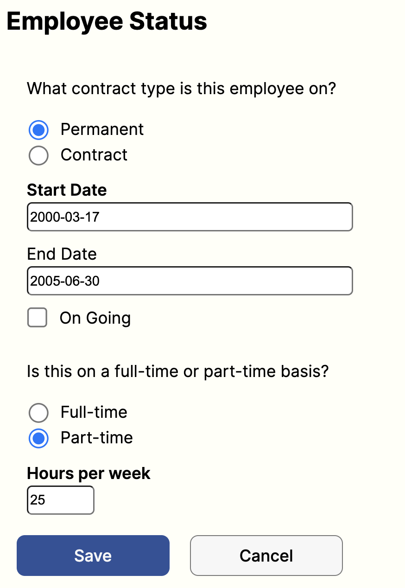

# Employee Creator API

## Demo & Snippets

-   Include hosted link
-   Include images of app if CLI or Client App

---

## Requirements / Purpose

    We need a web application to create, list, modify and delete employees.
    The application should consist of a Spring RESTful API and a React Typescript frontend.
    The schema for the employee is left to the criteria of the candidate.

## Stacks

## Frontend

-   React-TypeScript (initialized with Vite)
    -   SASS
    -   React Form Hook / Yup
    -   Axios
    -   React Router DOM

## Backend

-   Java / SpringBoot

    -   Spring Web,
    -   Validation I/O
    -   Spring Testing
    -   Spring Data JPA
    -   MySQL Driver
    -   Spring DevTools
    -   Junit5 / JAssert

---

## Build Steps

### Requirements

This project will require you to have a few things already installed on your machine in order to run it. If you do not have that on your machine, check out the links attached.

&rarr; [Node.js](https://nodejs.org/en/) \
&rarr; [mySQL](https://www.mysql.com/downloads/) as well as your favorite SQL Database Management System (DBMS), I use [MySQLWorkbench](https://dev.mysql.com/downloads/workbench/) \
&rarr; Your favorite IDE - I used [VSCode](https://code.visualstudio.com/download) to develop the Frontend and [IntelliJ](https://www.jetbrains.com/idea/download/?source=google&medium=cpc&campaign=9736964866&term=intellij%20idea&content=602143185778&gclid=CjwKCAiA0cyfBhBREiwAAtStHF6mDZ1o8uw-jfQWGpBZnWlxOJ6WkJtDmO0UTXBgP4dykGuq-Y3hDxoCfWUQAvD_BwE#section=mac) for the backend \
&rarr; Your favorite Web Browser

### Frontend

For non hosted version:

> Once the repository cloned to your local machine, run the below commands in your terminal / GitBash from the project directory\
> `cd frontend`\
> `npm run dev`

Vite will display which port to access on your localhost (e.g. http://localhost:5173/)

### Backend

-   SprinBoot Server

    > Once you have cloned the project's repository to your local machine you will want to import that project into your IDE as a Maven project\
    > Configure the application main class to run App.java using JDK v.17\
    > Run the application\
    > This will launch an instance of the SpringBoot server on your machine's port 8080 (http://localhost:8080)

-   SQL Database

    > If the project is run locally, you will also need an database instance to connect to your server.\
    > Create a new mySQL DB in your DBMS\
    > Update the application.properties file in your /backend/src/main/resources\
    > `spring.datasource.url = <YOUR_DB_URL>`\
    > `spring.datasource.username = <YOUR_USERNAME>`\
    > `spring.datasource.password = <YOUR_PASSWORD>`\
    > If you've connected your DB properly, every time you start the server, the DB should drop the `employee` table and populate it with 2 entries.

That's it. You have a full stack, locally run, application.

## Design Goals / Approach

The goal was to design an application allowing us to perform some basic CRUD operation. As with any React application, I decided to start as simple as possible when it came to component tree as I found that the less layer to handle the better.

I knew that at the minimum I would need a Form component to handle the CREATE request.
The specifications seemed to suggest that the displaying of the employees details should also happen in the Form component thus eliminating the need to have a dedicated component to handle that rendering.

The other part of the application was the Employee's List. I decided to split this into two components. A container that would handle the data/state logic (`<EmployeesList>`) and a presentational (stateless) component that would be rendered through mapping of the data obtained on the API call (`<EmployeeCard>`).

Further down the line I also decided to add a very simple `<NavBar>` component to ease the routing through the application rather than having to handle URL.

Finally, there is also an ultra simplistic styling component `<Separator>` that I use to create line separation between components. It conveniently takes in `width`, `height` and `backgroundColor` props to allow more reusability (vertical, horizontal).

---

## Features

-   Component(s): EmployeesList + EmployeeCard
    URL: /employees

    > Allow user to viusale all current employees\
    > API Endpoint: /employee -> GET => Returns all employees (that have not been archived)

    

-   Component(s): EmployeeForm\
    URL: /employees/newEmployee or /employees/:id

    > Allows to either create a new employee or to visualise a current employee's detail and to save modification made to their profile.\
    > API Endpoint: /employee/:id -> POST or PUT => Save new employee or changes for current employee

    
    

---

## Known issues

-   Remaining bugs, things that have been left unfixed
-   Features that are buggy / flimsy

---

## Future Goals

### Implementation of an Authentication Strategy

-   Restricting Adding new employees, deleting current employees to admins.
-   Defining another type of super admin that can visualized archived employees.

### Postal Address API auto-fill

### Better Date Picker / Formatter

### Add endDate when archiving an employee

###

---

## Changelog

### 20/02/2023 - Frontend React-TypeScript Vite, Component Creation, Axios and Form setup

-   FEATURE: Adds Axios UPDATE/PUT + ARCHIVE/DELETE methods. Adds Styling
    for EmployeeFOrm, EmployeeCard, EmployeeList. Adds Schema Validation fix.
-   FEATURE: adds EmployeeList + EmployeeCard component TSX. Adds Axios methods for getAll + CREATE/POST
-   FIX: Debuggs Backend test issue with H2 local DB - @where creating SQ…
    statement error - JdbcSQLSyntaxErrorException. Will need to make sure that Filtering happens in Service Layer
-   MINOR CHANGE: Fixed validation issues for ContractType and TimeBase radio selection in Yup Schema
-   FEATURE: Add EmployeeForm compomenent with YUP schema validation + Simple SCSS styling. Using React Form Hook
-   FRONT END FIRST COMMIT: Initialised TS-REACT app with Vite + Created Compoent Tree + Test API Response + Added CORS to BackEnd + Installed React Hook Form

### 19/02/2023 - Backend API Error Handling and Testing Setup

-   MINOR CHANGE: Adds BACKEND director to employeeAPI folder
-   FEATURE: Set up basic Tests using JUNIT and AssertJ Libraries
-   FEATURE: Adds API Error messages to users. Simple strategy will need reworking
-   FEATURE: Adds Logging strategy for each endpoint using the SLF4J library
-   MINOR CHANGE: Adds Logic in Service layer to handle unique email error

### 18/02/2023 - Backend API POST, PUT, DELETE endpoints setup

-   MINOR CHANGE: Adds Unique constraints on email field
-   FEATURE: Adds REAMDE content
-   FEATURE: updates the updateEmployeeDetails in the Service Layer for the PUT endpoint
-   FEATURE: Adds soft delete with deleted field on Employee table. Deleted Employee will not show when fetching all employees
-   MINOR CHANGE: Fix Mapper Typo Spring Bean
-   CONFIG: Adds MapStruct to pom.xml dependency list
-   FEATURE: Completes POST endpoint. Adds hard DELETE endpoint. Adds EmployeeDTO
-   FEATURES: Adds extra fields for Employee Entity to match MVP. Adds Transient timeWithCompany field calculated based on startDate + endDate/Date.now. Creates Basis for POST endpoint.

### 17/02/2023 - Project Initialization

-   MINOR CHANGE: Renames main class to be App.java
-   Adds Employee Controller and Service Layer as well as connection to l…
-   Initialized SpringBoot Project with HelloWorld GET Request - WORKING
-   Initial commit

---

## What did you struggle with?

-   What? Why? How?

### CORS Issues

### React Hook Forms

> Default checked values for Radio Buttons
> Prefilled Forms giving validation error

### @Where Clause & Failing Backend Tests

While trying to set up my back end test and starting my H2 local database, I got stuck on this error.


The error message inside the logs were not very helpful, and it took a lot of Googling and trial error to find the source of the issue. As one of the error I was getting was that the SQL statement was failing because the `DELETED` column could not be found, I first played around with adding that field the Entity constructor (which it should not need as it is set by default to `FALSE`)
Eventually I traced the error all the way back to the fact that I was using a `@Where` annotation inside my `Employee` Entity which seemed to create some conflict with the test.

I removed that and implement this filtering functionality inside my Service Layer, only returning Employees that have the `DELETED` field set to `FALSE`

---

## Licensing Details

-   What type of license are you releasing this under?

---

## Further details, related projects, reimplementations

-   Is this project a reimplementation for something you've done in the past? if so explain it and link it here.
-   If it's an API, is there a client app that works with this project? link it

```

```
